# A/B testing — Is there a better way? An exploration of multi-armed bandits
## The algorithms of Epsilon-Greedy, Softmax, UCB, Exp3, and Thompson Sampling

In this repo, I’ve simulated a traditional A/B test and here discuss its shortcomings, then I’ve simulated some different multi-armed bandit algorithms which can alleviate many of the problems with a traditional A/B test. Finally, I've discussed the termination criteria for the specific case of Thompson Sampling.

### Part 1: Traditional A/B testing
Websites today are meticulously designed to maximize one or even several goals. Should the “Buy Now!” button be red or blue? What headline attracts the most clicks to that news article? Which version of an advertisement has the highest click-through rate? To determine the optimal answer to these questions, software developers employ A/B tests — a statistically sound technique to compare two different variants, version A and version B. Essentially, they’re trying to determine whether the mean value in the blue distribution below is actually different than the mean value of the red distribution, or is that apparent difference actually just due to random chance?

In a traditional A/B test, you start by defining what minimum difference between the versions is meaningful. In the above distributions, version A (usually, the current version) has a mean of 0.01. Let’s say this is a 1% click-through rate, or CTR. In order to change our website to version B, we want to see a minimum of 5% improvement, or a CTR of at least 1.05%. Next, we set our confidence level, the statistical confidence that our observed results are due to a true difference as opposed to random chance. Typically, this is called **alpha** and set to 95%. In order to determine how many observations to collect, we use power analysis to determine the required sample size. If alpha can be thought of as the acceptable rate of making a Type I error (False Positive), **power** can be thought of as the acceptable rate of making a Type II error (False Negative).

Many statisticians believe a Type I error is 4x as costly as a Type II error. Put another way: Your eCommerce website is currently running fine. You believe you’ve identified a change that will increase sales so you implement the change, only to find out that the change actually hurt the website. This is a **Type I error** and has lost you sales. Now imagine that you consider making a change but decide it won’t improve things, even though in reality it would have, and so you don’t make the change. This is a **Type II error**, and cost you nothing but potential opportunity. So if we set our confidence level to 95%, that means that we’re willing to accept a Type I error in only 5% of our experiments. If a Type I error is 4x as costly as a Type II error, that implies that we set our power to 80%; we’re willing to be conservative and ignore a potentially positive change 20% of the time.

Version A is what’s currently running. So we have historical data and can calculate a mean CTR and corresponding standard deviation. We’ll need these values for version B though, which doesn’t yet exist. For the mean, we’ll use that 5% improvement value, so `mean_b = 1.05 * mean_a`. Standard deviation though will need to be estimated. This can be a severe downside to traditional A/B testing when this estimation is difficult. In our case though, we’ll just assume version B will have the same standard deviation as version A. With **sigma** standing in for standard deviation and **d** being the difference between our two means, we’ll need to look up **z-scores** for both **alpha** and **beta**, and calculate our sample size with this equation:

With that, we simply run our A/B test until the required sample size is obtained. We randomly show visitors to our site either version A or version B and record the CTR for each version. You then either use a stats package or [t-test calculations and a t-test table](https://github.com/raffg/natgeo_instagram_anomaly/blob/master/README.md) to arrive at a **p-value**; if the p-value is less than your alpha, 0.05 in this case, then you can state with 95% confidence that you have observed a true difference between version A and version B, not one due to chance.

#### Drawbacks to the traditional A/B test
The greatest drawback to a traditional A/B test is that one version may be vastly inferior to another, and yet you must continue to offer that version to visitors until the test is complete, thus losing sales. As stated earlier, you also must arrive at an estimate of standard deviation for your version B; if your guess is incorrect, you may not collect enough samples and fail to achieve statistical power; that is, even if version B truly is better than version A and even if your experiment demonstrates this fact, you do not have enough samples to declare the difference statistically significant. You’ll be forced into a False Negative.
It would be great if there was a way to run an A/B test, but not waste time on an inferior version B (or C, D, and E…).

---

## Part 2: Multi-Armed Bandits

Those old slot machines with the single lever on the side which always take your money — those are called one-armed bandits.

Imagine a whole bank of those machines lined up side-by-side, all paying out at different rates and values. This is the idea of a multi-armed bandit. If you’re a gambler who wants to maximize your winnings, you obviously want to play the machine with the highest payout. But you don’t know which machine this is. You need to explore the different machines over time to learn what their payouts are, but you simultaneously want to exploit the highest paying machine. A similar scenario is [Richard Feynman’s restaurant problem](https://www.feynmanlectures.caltech.edu/info/exercises/Feynmans_restaurant_problem.html). Whenever he goes to a restaurant, he wants to order the tastiest dish on the menu, but he has to order everything available to find what is that best dish. This balance of **exploitation**, the desire to choose an action which has payed off well in the past, and **exploration**, the desire to try options which may produce even better results, is what multi-armed bandit algorithms were developed for.

How do they do this? Let’s take a look at several algorithms. I won’t spend too much time discussing the mathematics of these algorithms, but I will link to my Python implementations of each of them in the [algorithms folder](https://github.com/raffg/multi_armed_bandit/tree/master/algorithms) which you can refer to for further details. I’ve used the same notation for each algorithm so the `select_arm()` and `update()` functions should fully describe the math.

#### Epsilon-Greedy
The [Epsilon-Greedy](https://github.com/raffg/multi_armed_bandit/blob/master/algorithms/epsilon_greedy.py) algorithm balances exploitation and exploration fairly basically. It takes a parameter, `epsilon`, between 0 and 1, as the probability of exploring the options (called arms in multi-armed bandit discussions) as opposed to exploiting the current best variant in the test. For example, say epsilon is set at 0.1. Every time a visitor comes to the website being tested, a number between 0 and 1 is randomly drawn. If that number is greater than 0.1, then that visitor will be shown whichever variant (at first, version A) is performing best. If that random number is less than 0.1, then a random arm out of all available options will be chosen and provided to the visitor. The visitor’s reaction will be recorded (a click or no click, a sale or no sale, etc.) and the success rate of that arm will be updated accordingly.

There are a few things to consider when evaluating multi-armed bandit algorithms. First, you could look at the probability of selecting the current best arm. Each algorithm takes a bit of time to stabilize and find the best arm, but once stabilization is reached epsilon-Greedy should select the best arm at a rate of (1-epsilon) + epsilon/(number of arms). This is because (1-epsilon)% of the time, it will automatically select the best arm and then the remaining time it will select all arms at an equal rate. For different values of epsilon, this is what the accuracy looks like:

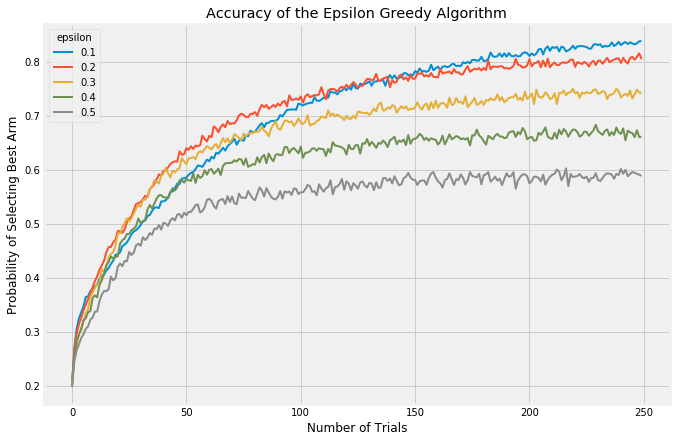

In all these trials, I’ve simulated 5 arms with failure/success ratios of `[0.1, 0.25, 0.5, 0.75, 0.9]`. These values span a far wider range than would typically be seen in a test like this, but they allow the arms to display their behavior after simulating far fewer iterations than would otherwise be required. Each graph is the result of averaging 5000 experiments with a horizon of 250 trials.

Low values of `epsilon` correspond to less exploration and more exploitation, therefore it takes the algorithm longer to discover which is the best arm but once found, it exploits it at a higher rate. This can be see most clearly with the blue line starting off slowly but then passing the other arms and stabilizing at a higher rate.

When there are many arms at play, all roughly similar in expected reward, it can be valuable to look at the average reward of an algorithm. The following chart again shows a handful of values for epsilon compared:

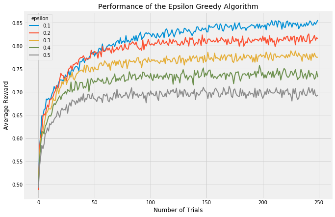

Both of these approaches, however, focus on how many trials it takes to find the best arm. An evaluation approach which looks at cumulative reward will treat algorithms which focus upfront on learning more fairly.

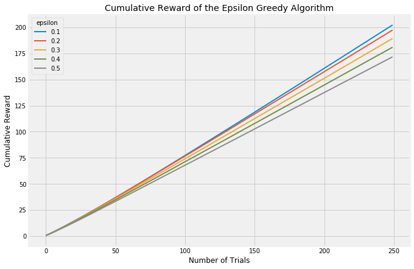

Clearly, choosing the value of `epsilon` can matter a great deal and is not trivial. Ideally, you would want a high value (high exploration) when the number of trials is low, but would transition to a low value (high exploitation) once learning is complete and the best arm is known. There is a technique called annealing, which I will not go into too much detail here on, but it is pretty simple. Again, see my [code](https://github.com/raffg/multi_armed_bandit/blob/master/algorithms/epsilon_greedy_annealing.py) for details, but it basically does exactly what I described: adjust `epsilon` as the number of trials increases. Using the annealed epsilon-Greedy algorithm and plotting the rate of selecting each arm looks like this:

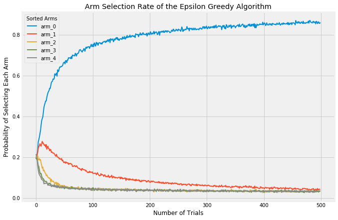

With these (admittedly extreme) values for each arm, the algorithm very quickly settles on `arm_0` as the best and selects the remaining arms a fraction of the time.

One of the greatest advantages of multi-armed bandit approaches is that you can call off the test early if one arm is clearly the winner. In these experiments, each single trial is a Bernoulli trial — the outcome is either success (an ad click, a sale, an email sign-up) or a failure (the user closes the webpage with no action). These trials in aggregate can be represented with Beta distributions. Look at the following graphic. At first, each arm has an equal probability of any outcome. But as more and more trials accumulate, the probability of success of each arm becomes more and more focused on its actual, long-term success probability. Note that the y-axis is the probability density and is increasing in each frame; I’ve omitted it for clarity so just remember that the area under each curve is always exactly 1. As the curves get more narrow, they correspondingly get taller to maintain this constant area.

Notice how the peaks of each arm start to center around their actual payout probabilities of `[0.1, 0.25, 0.5, 0.75, 0.9]`. You can use these distributions to run statistical analyses and stop your experiment early if you reach statistical significance. Another way to look at these changes statically:

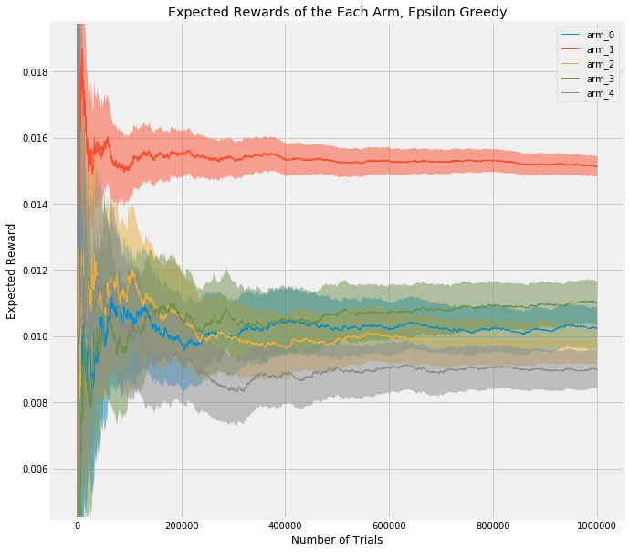

This shows a single experiment with a horizon of 1,000,000 trials (as opposed to the average results of 5000 experiments with a horizon of 250), and with more realistic values of `[0.01, 0.009, 0.0105, 0.011, 0.015]` (in this case, I’ve simulated click through rate, CTR). But what I want to point out is that `arm_1`, the best arm, is used much more frequently due to the way epsilon-Greedy favors it. The 5% confidence interval (shaded area) around it is much tighter than the other arms. Just as in the gif above, where the best arm has a much tighter and taller bell curve, representing a more precise estimate of the value, this chart shows that using a multi-armed bandit approach allows you to exploit the best arm while still learning about the others, and reach statistical significance earlier than in a traditional A/B test.

#### Softmax
An obvious flaw in epsilon-Greedy is that it explores completely at random. If we have two arms with very similar rewards, we need to explore a lot to learn which is better and so choose a high epsilon. However, if our two arms have vastly different rewards (and we don’t know this when we start the experiment, of course), we would still set a high epsilon and waste a lot of time on the lower paying reward. The [Softmax](https://github.com/raffg/multi_armed_bandit/blob/master/algorithms/softmax.py) algorithm (and its [annealed counterpart](https://github.com/raffg/multi_armed_bandit/blob/master/algorithms/softmax_annealing.py)) attempt to solve this problem by selecting each arm in the explore phase roughly in proportion to the currently expected reward.

.  |  .
:-------------------------:|:-------------------------:
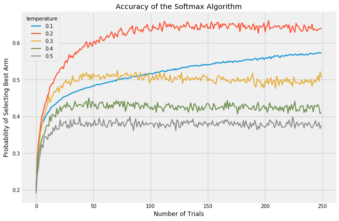  |  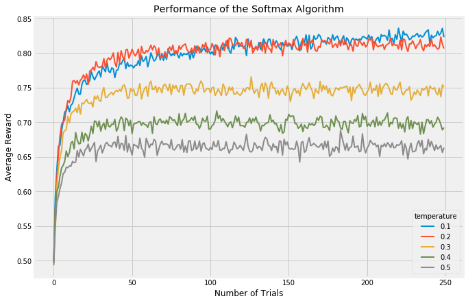
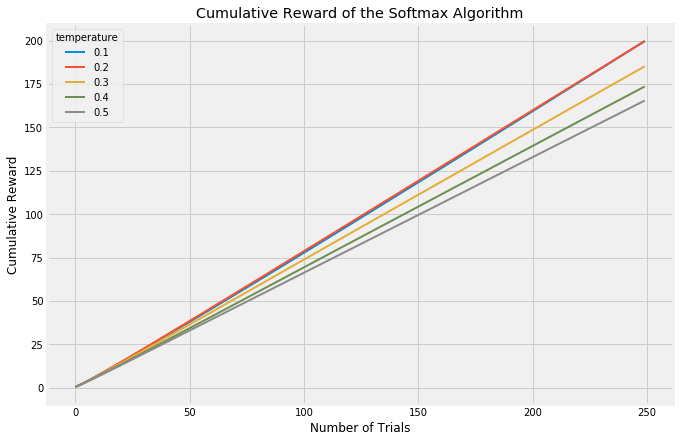    |  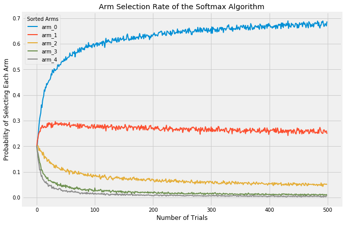

The `temperature` parameter has a purpose similar to `epsilon` in the epsilon-Greedy algorithm: it balances the tendency to either explore to exploit. At the extremes, a temperature of 0.0 will *always* choose the best performing arm. A temperature of infinity will *randomly* choose any arm.

What I want you to observe when comparing these algorithms is their different behavior with regards to the explore/exploit balance. This is the crux of the multi-armed bandit problem.

#### UCB1
Whereas the Softmax algorithm takes into account the expected value of each arm, it’s certainly plausible by that sheer random chance a poor performing arm will at first have several successes in a row and thus be favored by the algorithm during the exploit phase. They’ll under-explore arms which may have a high payout even though they don’t have enough data to be confident. Thus, it seems reasonable to take into account how much we know about each arm and encourage an algorithm to slightly favor those arms of which we don’t have high confidence in their behavior, so that we can learn more. The Upper Confidence Bound class of algorithms was developed for this purpose; here, I’ll demonstrate two versions, UCB1 and UCB2. They operate similarly.

[UCB1](https://github.com/raffg/multi_armed_bandit/blob/master/algorithms/ucb1.py) doesn’t display any randomness at all (you can see in my code that I never import the `random` package at all!). It is fully deterministic, as opposed to both epsilon-Greedy and Softmax. Also, the UCB1 algorithm does not have any parameters needing tuning, which is why the below charts show only one variant. The key to the UCB1 algorithm is its “curiosity bonus”. When selecting an arm, it takes the expected reward of each arm and then adds a bonus which is calculated in inverse proportion to the confidence of that reward. It is optimistic about uncertainty. So lower confidence arms are given a bit of a boost relative to higher confidence arms. This causes the results of the algorithm to swing wildly from trial to trial, especially at the early phases, because each new trial provides more information to the chosen arm and so the other arms will essentially be favored more in the coming rounds.

.  |  .
:-------------------------:|:-------------------------:
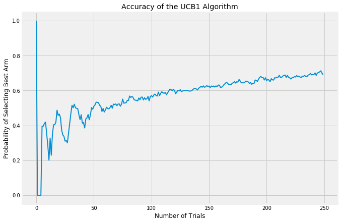  |  
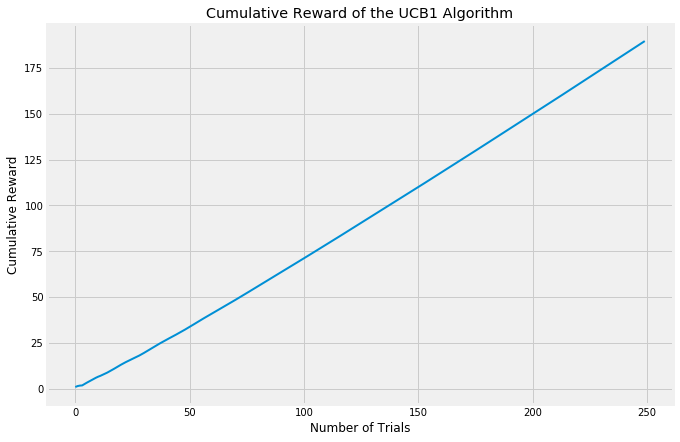    |  

#### UCB2
The [UCB2 algorithm](https://github.com/raffg/multi_armed_bandit/blob/master/algorithms/ucb2.py) is a further development of UCB1. The innovation with UCB2 is to ensure that we trial the same arm for a certain period before trying a new one. This also ensures that in the long term, we periodically take a break from exploiting to re-explore the other arms. UCB2 is a good algorithm to use when rewards are expected to change over time; in the other algorithms, once the best arm is discovered it is heavily favored until the end of the experiment. UCB2 challenges that assumption.

UCB2 has a parameter, `alpha` which is effective at tuning the length of UCB2’s periods of favoring certain arms.

.  |  .
:-------------------------:|:-------------------------:
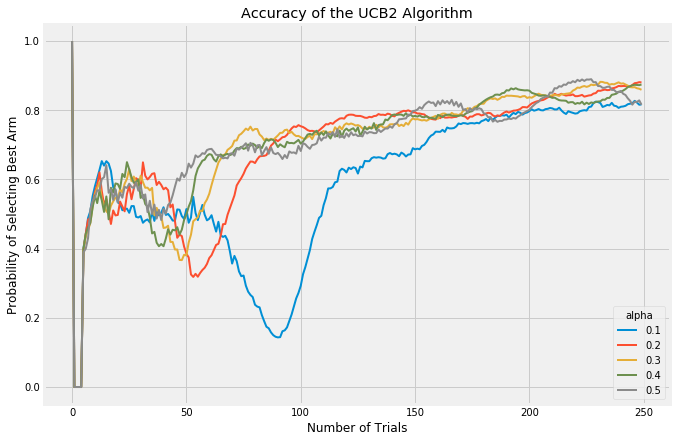  |  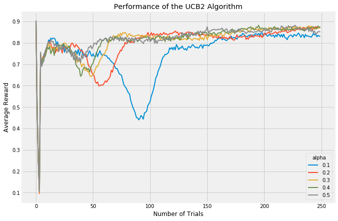
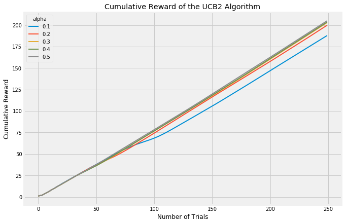    |  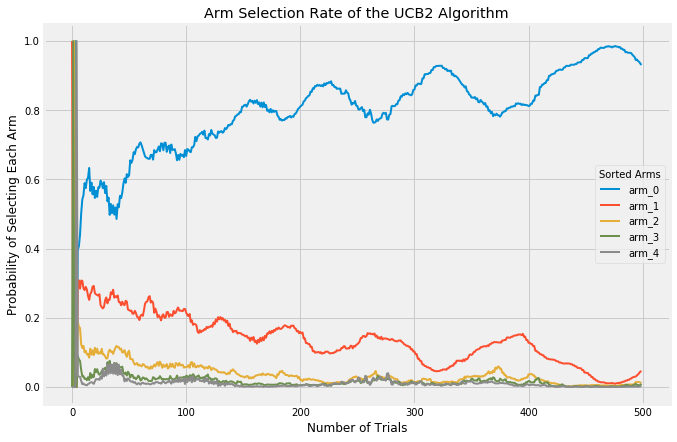

#### Exp3
Finally, we have the [Exp3 algorithm](https://github.com/raffg/multi_armed_bandit/blob/master/algorithms/exp3.py). The UCB class of algorithms is considered the best performing in a **stochastic** setting; ie, the results of each trial are fully random. The Exp3 algorithm in contrast was developed to handle scenarios where the trials are **adversarial**; that is, we want to consider the possibility that the expected outcome of future trials may be changed by the results of previous trials. A good example of when the Exp3 algorithm might be good is with the stock market. Some investors see a stock listed at a low price per share and buy it up even though its current return isn’t that great, but the very act of buying up the stock in high volume causes its price to surge and its performance as well. The expected earnings of that stock is changing as a result of our algorithm predicting one thing or another. As such, in these experiments here, the Exp3 appears to be performing much worse than the other algorithms. I’m running each trial fully randomly, this is a stochastic setting in which Exp3 was never developed to be strong in.

.  |  .
:-------------------------:|:-------------------------:
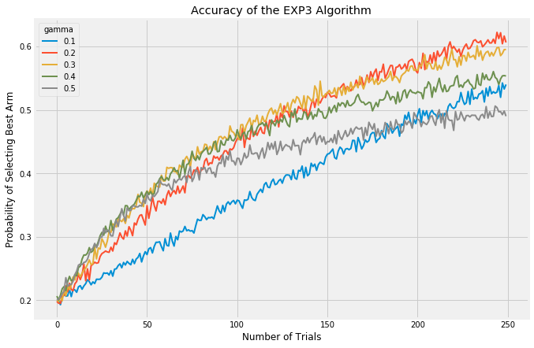  |  
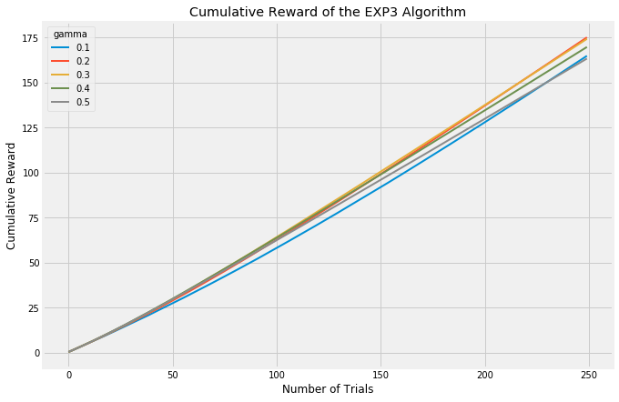    |  

### Comparing Algorithms
So now, let’s take a look at all those algorithms together. As you can see, in this short set of trials, UCB2 and epsilon-Greedy look like they’re running together, with UCB2 taking many more opportunities to explore. However, UCB2 is improving slightly more quickly and indeed in longer timeframe, it surpasses epsilon-Greedy. Softmax tends to peak out quite early, indicating that it continues to explore at the expense of exploiting its knowledge of the best arm. UCB1, being an early version of UCB2, trails its more innovative brother as would be expected. Exp3 is an interesting one; it appears to be the lowest performing by far, but this is to be expected as these trials are not what Exp3 is good at. If instead the trial environment were adversarial, we would expect Exp3 to be much more competitive.

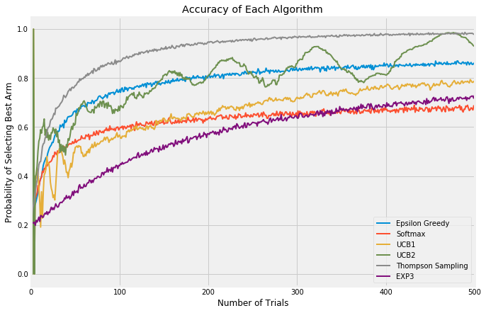
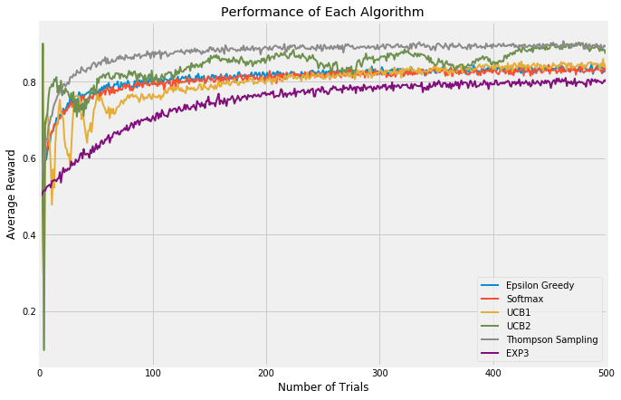
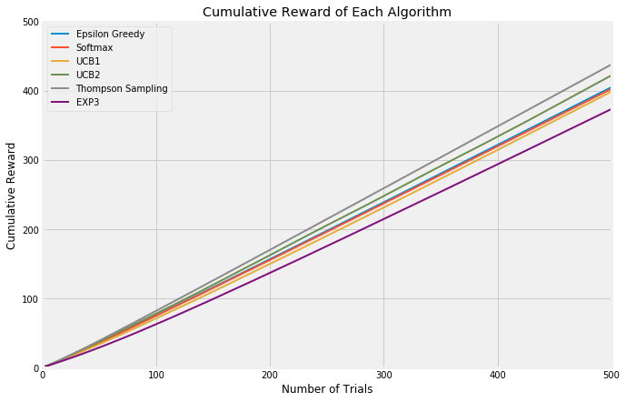

There’s one algorithm in those charts which we haven’t discussed yet, **[Thompson Sampling](https://github.com/raffg/multi_armed_bandit/blob/master/algorithms/thompson_sampling.py)**. This algorithm is fully Bayesian. It generates a vector of expected rewards for each arm from a posterior distribution and then updates the distributions.

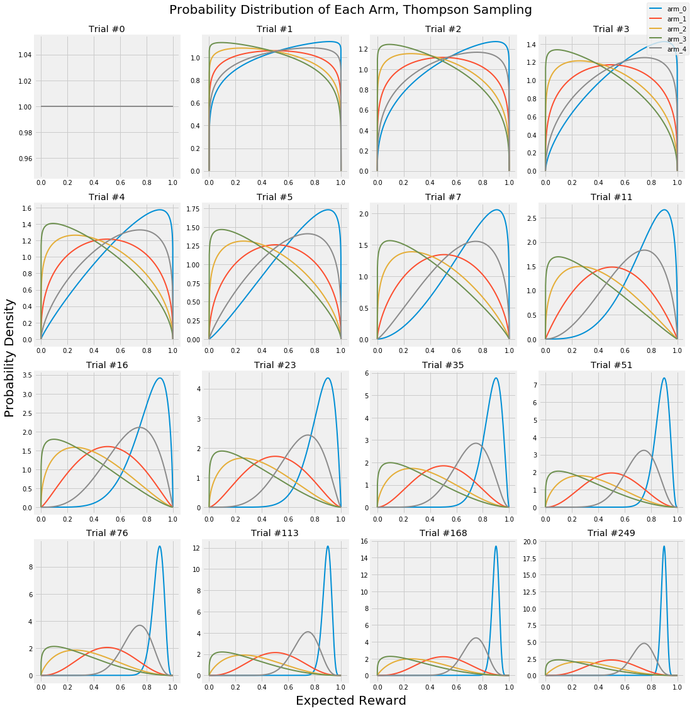

The algorithm draws a random number from the changing probability distributions and selects the largest. It simply pulls the lever with the highest expected reward at each trial. Thompson Sampling learns *very* quickly which is the best arm and *heavily* favors it going forward, at the expense of exploration. Just look at the uncertainty (the width of the shaded area) in all the other arms! That’s the result of nearly pure exploitation and little exploration.

### When do you end your multi-armed bandit experiment?
Because Thompson Sampling draws from arms at the frequency given by their beta distribution, we can use many statistical techniques of uncertainty to know when one arm surges ahead due to superiority as opposed to chance. Google Analytics has developed a sound solution using what they call **[Potential Value Remaining](https://support.google.com/optimize/answer/7405044?hl=en)**. They first check for three criteria to be met, and then check that a "champion" arm has emerged, and call the experiment complete. Those three criteria are:

- There is active daily traffic on the website
- The experiment has run a minimum of two weeks, in order to cancel out any weekly periodicity.
- Potential Value Remaining is less than 1%

At that point, once any arm is selected at least 95% of the time, the experiment concludes.

Potential Value Remaining is also called "regret" in the literature. It describes how much a metric such as CTR may still improve above the leader. When the chance that another arm may beat the leader by only 1% more, that meager improvement isn't worth continuing the test.

Potential value remaining in the test is calculated as the 95th percentile of the distribution of `(θₘₐₓ - θ*) / θ*`, where `θₘₐₓ` is the largest value of `θ` in a row, and `θ*` is the value of `θ` for the variation that is most likely to be optimal, with `θ` being the value drawn from each arm's beta distribution. As before, for the details of the math please refer to my [code](https://github.com/raffg/multi_armed_bandit/blob/master/simulation_framework/simulation_framework.py), or read the [original paper](https://static.googleusercontent.com/media/research.google.com/en//pubs/archive/42550.pdf) published by a Google engineer.

In the traditional A/B test I described at the beginning of this article, with a confidence interval of 95%, power of 80%, version A CTR of 1%, and hypothesizing a version B CTR of 1.05%, the required sample size was a minimum of **635,829** sample draws from each version. In my experiment, I rounded up to 700,000 draws for each arm.

When using Thompson Sampling with Google's termination criteria, I simulated 100 experiments and averaged the results. I was able to achieve the same certainty that version B was 5% better with an average of **5,357** pulls on the inferior version A arm, and 6,353 pulls on the superior version B.

> **In the traditional A/B test, I would have served my customers an inferior version of my website over 600,000 times, whereas Thompson Sampling required just over 5,000 to learn the same thing. That's 120x fewer mistakes!**

---

So which bandit is best? It really depends upon your application and needs. They all have their benefits and drawbacks and suitability to specific cases. Epsilon-Greedy and Softmax were early developments in the field and tend not to perform as well as, in particular, the Upper Confidence Bound algorithms. In the realm of web testing, the UCB algorithms do seem to be used most frequently although Thompson Sampling offers the benefits of termination criteria and is the algorithm used by Google Analytics' Optimize tool. If your context is not stochastic though, you may want to try the Exp3 algorithm which performs better in an adversarial environment.